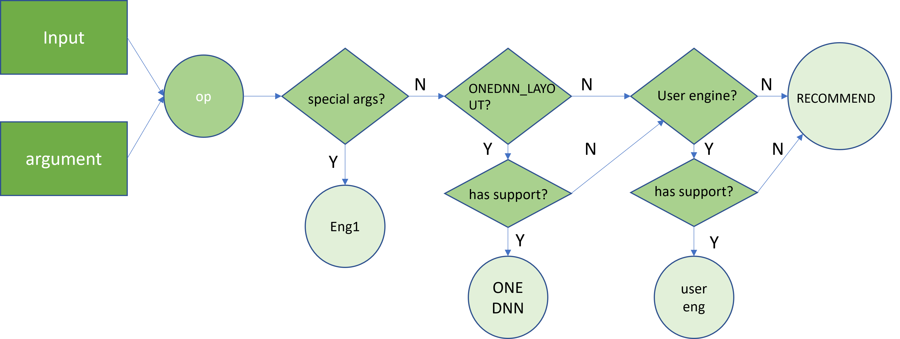

Compute Engine (Prototype feature for debug)
===============================================

## Introduction

Compute engine provides the capacity to choose specific backend for operators with multiple implementations. For example, with compute engine set, we can prefer to using SYCL than oneDNN implementation for concatenation. The feature can help user to customize model forward behavior for better performance or special requirement.

We currently support 5 compute engines, namely, `RECOMMEND`, `BASIC`, `ONEDNN`, `ONEMKL`, `XETLA`. Each op with multiple implementations has a recommend one based on our empirical experience. The `RECOMMEND` engine would guarantee performance on most shape input ideally.  `BASIC` engines refers to SYCL implementation. `ONEDNN`, `ONEMKL`, `XETLA` refers to optimized implementation provided by library [Intel® oneAPI Deep Neural Network Library (oneDNN)](https://github.com/oneapi-src/oneDNN), [Intel® oneAPI Math Kernel Library (oneMKL)](https://github.com/oneapi-src/oneMKL) and [Intel® Xe Templates for Linear Algebra](https://github.com/intel/xetla).

## Use Case

Code snippet below demonstrates the usage of compute engine feature to select oneDNN as the compute engine of operator `torch.cat`.

```python
with torch.xpu.compute_eng(torch.xpu.XPUComputeEng.ONEDNN):
    x1 = torch.randn((1, 3, 20, 20), device="xpu")
    x2 = torch.randn((1, 5, 20, 20), device="xpu")
    torch.cat([x1, x2], dim=1)
```

## Engine Selection Policy
Generally, priority of choosing engine follows the order `operator special argument > onednn_layout format input > user set engine > recommend engine`. Check the following for details:

Step 1: In some cases, operators with specific arguments may not have implementations for all compute engines. For these operators, the implemented compute engines have the highest priority in the selection process. For example, operator `torch.nn.Upsample` with argument `align_corners=True` has only SYCL implementation for GPU. Thus, the BASIC engine, referring to SYCL implementations, is always its computing engine.

Step2: If no special argument, and inputs contain `ONEDNN_LAYOUT` Tensor, `ONEDNN` engine would be chosen if possible. This would utilize the highly optimized code in library oneDNN to speedup computation.  If `oneDNN` has no support for the operator, engine selection process continues to next step.

Step3: If user manually set a engine, this engine is chosen once the operator supports this implementation.

Step4: If the compute engine designated by user is not implemented/available, execution of the operator will fall back on to the `RECOMMEND` engine.




## Multiple Implementations Operators and Engines
`AveragePool2d`: `ONEDNN`, `BASIC` [Recommend]

`Concat`: `ONEDNN`, `BASIC` [Recommend]

`MaxPool2d`, `MaxPool3d`: `ONEDNN`, `BASIC` [Recommend]

`LSTM`: `ONEDNN`, `BASIC` [Recommend]
    
    Basic is recommended currently. When optimizations in oneDNN finish, `ONEDNN` would be the recommend engine.

`LayerNorm`： `ONEDNN`, `BASIC` [Recommend]

`PermuteContiguous`: `ONEDNN`, `BASIC` [Recommend]

`SoftMax`: `ONEDNN`, `BASIC` [Recommend] 
    
    The `BASIC` engine is always chosen if input tensor has `dimension` greater than 3 or its `dtype` is other than `fp16, fp32` or `bfloat16`.

`UpsampleBlinear2d`: `ONEDNN`, `BASIC` [Recommend] 

    The `BASIC` engine is always chosen if argument `align_corners=True`.

`UpsampleNearest`: `ONEDNN`, `BASIC` [Recommend] 
    
    The `ONEDNN` engine is always chosen if output shape is divisible by the input shape.

