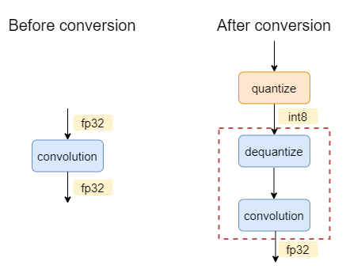

Graph Optimization
==================

Most Deep Learning models could be described as DAG(directed acyclic graph). Therefore, how to optimize a deep learning model from graph perspective is a nature thinking. Compared to the operator optimization and algorithm optimization, the graph optimization is at more high level. It convers not only the graph self but also the runtime. From the operator perspective, the graph optimization contains the operator fusing, the constant folding. From the runtime perspective, the graph optimization contains the operator scheduling, the computation resources management, the memory mangement.

Currently, the Intel Extension for PyTorch focuses on the operator related graph optimizations. Regarding the runtime related optimization, the extension also provides some experiment features. Please refer to the runtime extension for more details about runtime optimization.


## Fusion
### FP32 and BF16 fusion patterns
- Conv2D + ReLU
- Conv2D + SUM
- Conv2D + SUM + ReLU
- Conv2D + Sigmoid
- Conv2D + Sigmoid + MUL
- Conv2D + HardTanh
- Conv2D + SiLU
- Conv2D + ELU
- Conv3D + ReLU
- Conv3D + SUM
- Conv3D + SUM + ReLU
- Conv3D + SiLU
- Linear + ReLU
- Linear + GELU
- Add + LayerNorm
- Div + Add + Softmax
- Linear + Linear + Linear
- View + Transpose + Contiguous + View

### INT8 fusion patterns
The `ipex.quantization.convert(model, conf, inputs)` API will convert an FP32 `torch.nn.Module` to a quantized JIT ScriptModule according to the given quantization recipes.

For example, for a FP32 model of one single convolution, the graph before and after conversion will be:

 
The oneDNN graph backend will select `dequantize` and `convolution` into one partition. During execution, this partition will execute a convolution with int8 as input and fp32 as output. 

Here listed all the currently supported int8 patterns in Intel® Extension for PyTorch\* using oneDNN graph backend:
1. Patterns with int8 as input and fp32 as output:
- dequant -> conv
- dequant -> linear
- dequant -> conv -> relu
- dequant -> conv -> sum
- dequant -> conv -> sum -> relu
- dequant -> linear -> relu
- dequant -> linear -> gelu
- dequant -> linear -> sigmoid
- dequant -> linear -> sum
- dequant -> bmm
- dequant -> bmm -> div

2. Patterns with int8 as input and int8 as output:
- dequant -> conv -> quant
- dequant -> linear -> quant
- dequant -> conv -> relu -> quant
- dequant -> conv -> sum -> dequant
- dequant -> conv -> sum -> relu -> quant
- dequant -> linear -> relu -> quant
- dequant -> linear -> gelu -> quant
- dequant -> linear -> sigmoid -> quant
- dequant -> linear -> sum -> quant
- dequant -> bmm -> quant
- dequant -> bmm -> div -> quant
- dequant -> max_pool2d -> quant


## Folding
Stock PyTorch has provided the constant propagation and BatchNormalization folding. And these optimizations will be automatically applied to the jit model by invoking `torch.jit.freeze`. Take the Resnet50 as the example:
```
import torch
import torchvision.models as models
model = models.__dict__["resnet50 "](pretrained=True)
model.eval()
x = torch.randn(args.batch_size, 3, 224, 224)
with torch.no_grad():
    model = torch.jit.trace(model, x, check_trace=False).eval()
    # Fold the BatchNormalization and propagate constant
    torch.jit.freeze(model)
    # Print the graph
    print(model.graph_for(x))
```
If the model owner does not invoke the `torch.jit.freeze`, the `BatchNormalization` still exists on the graph. Otheriwse, the `BatchNormalization` will be folded on the graph to save the compuation and then improve the performance. Please refer to the https://en.wikipedia.org/wiki/Constant_folding for more details.


## Ease-of-use graph optimization API
The graph optimizations of Intel® Extension for PyTorch\* are enabled by default. Users could disable it by calling:
```
ipex.enable_onednn_fusion(False)
```

### FP32 and BF16 models
```
import torch
import torchvision.models as models

# Import the Intel Extension for PyTorch
import intel_extension_for_pytorch as ipex

model = models.__dict__["resnet50 "](pretrained=True)
model.eval()

# Apply some fusions at the front end
model = ipex.optimize(model, dtype=torch.float32)

x = torch.randn(args.batch_size, 3, 224, 224)
with torch.no_grad():
    model = torch.jit.trace(model, x, check_trace=False).eval()
    # Fold the BatchNormalization and propagate constant
    torch.jit.freeze(model)
    # Print the graph
    print(model.graph_for(x))
```
Compared the original code, the model launcher just needs to add few lines of code, the extension will automatically acceletate the  model. Regarding the RN50, the extension will automatically fuse the Conv + ReLU and Conv + Sum + ReLU as ConvReLU and ConvSumReLU. If you check the output of `graph_for`, you will observe the fused operators.

### INT8 models
```
import torch
import intel_extension_for_pytorch as ipex


# First-time quantization flow 
# define the model 
def MyModel(torch.nn.Module): 
  … 

# construct the model 
model = MyModel(…) 
conf = ipex.QuantConf(dtype=torch.int8) 
model, conf = ipex.quantization.prepare(model, conf) 
for images in calibration_data_loader(): 
  with ipex.quantization.calibrate(conf): # here, conf is in/out, populated with observed statistics 
    model(images) 
conf.save(‘int8_conf.json’, default_recipe=True) # optional: save the configuration for later use 
model = ipex.quantization.convert(model, conf, sample_image) 

# run the model 
output = model(images) 

# Deployment 
import intel_extension_for_pytorch as ipex
conf = ipex.QuantConf(‘int8_conf.json’) 
model = ipex.quantization.convert(model, conf, sample_image) 
output = model(images) 
```
